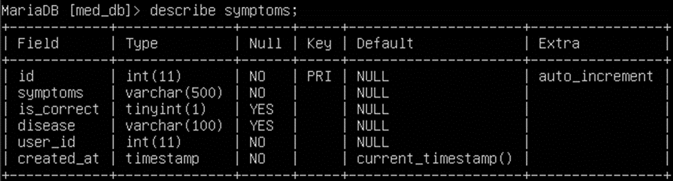

# Анализирующая система для здравоохранения с применением Data Science
## Инструменты:
- Python
- Pandas
- Sikit-Learn
- Telebot
- MariaDB
- Pymorphy2
- Pickle

## Задачи:
- Анализ симптомов пользователей и предсказания по ним заболеваний 
- Оценка предсказанных симптомов пользователями

## Конфиг
файл (Config.py) настроек системы, должен содержать следующие параметры:
### Mariadb conf
- USER = "****"
- PASSWORD = "****"
- HOST = "************"
- PORT = ****

### Telebot conf
- SECRET_KEY = "" (telegram bot secret key)

### Aliases
- DB_NAME = "****" (название баз данных)
- SYMPTOMS_TABLE = "****" 
- USERS_TABLE = "****" 
- USER_STATES_TABLE = "****" 
- SEPARATE_SYMBOL = ';' (символ по которому данные соединяются и разбиваются в программе)

## Таблицы
Таблица в которой хранятся данные пользователей

Таблица в которой сохраняется текущее состояние пользователя в системе

Таблица в которой хранятся симптомы и заболевания пользователей
